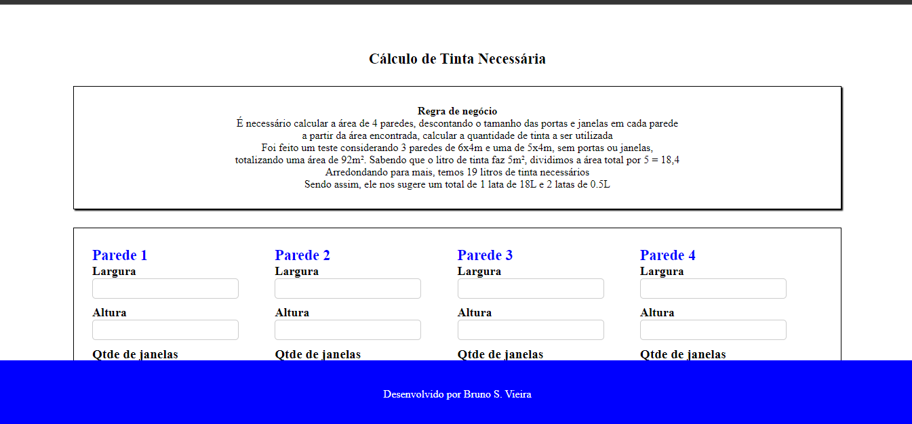
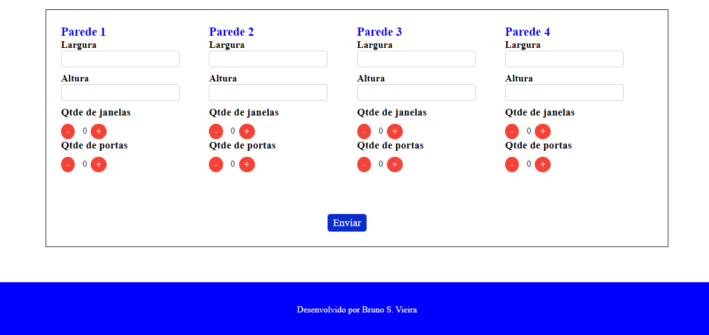
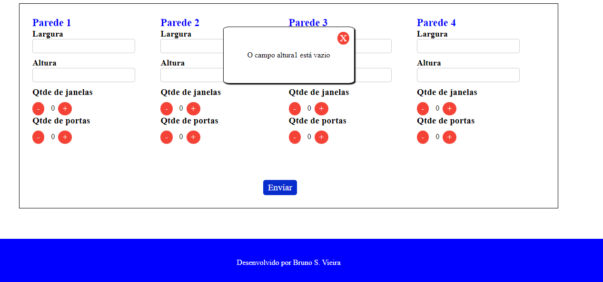
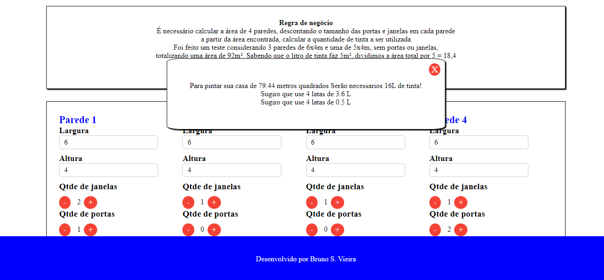

# ProjetoTintaNecessaria
 
Faça o download do projeto: Baixe o projeto "ProjetoTintaNecessaria" em seu computador.

Configure o ambiente: Certifique-se de ter o PHP na versão 7.4.20 e o Laravel Framework 8.83.27 instalado em seu computador.

Acesse a pasta do projeto: Abra o terminal e navegue até a pasta onde você baixou e entre na pasta "tintaNecessaria".

Instalar as dependências: Utilize o gerenciador de pacotes do PHP, o composer, para instalar as dependências do projeto abra o cmd na pasta. Utilize o comando **composer install** na pasta do projeto.

Garata que seu .env esteja com esse nome ao baixar o nome pode estar renomeado como .env.example 

Para garantir que o programa rode normalmente rode o comando **php artisan key:generate** no cmd na pasta

Inicie o projeto: Utilize o comando php artisan serve para iniciar o projeto e acesse-o pelo endereço http://localhost:8000/ no seu navegador.

No projeto foi adicionado um formulario onde pode se colocar Altura e Largura 

Também foi validado se os campos estao sendo passados vazios 

A resposta virá como uma modal na tela 

