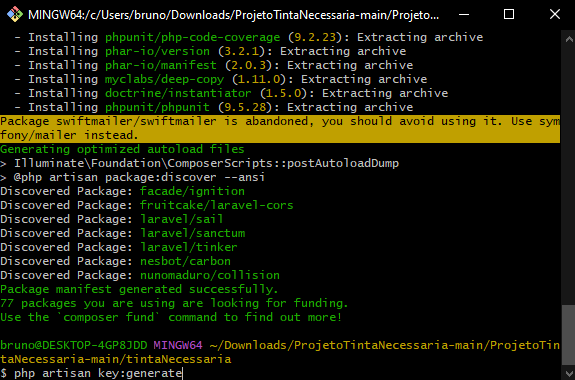

@digitalrepublic, @thiagomontini , @nicoleteisen
# ProjetoTintaNecessaria
 
Faça o download do projeto: Baixe o projeto "ProjetoTintaNecessaria" em seu computador.
voce pode clicar no botão em amarelo eu trouxe ele no formato .zip

há varias formas de baixar o projeto aqui vamos exemplificar pelo arquivo compactado.
Acesse a pasta do projeto: Abra o terminal e navegue até a pasta onde você baixou e entre na pasta "tintaNecessaria".

Instalar as dependências: Utilize o gerenciador de pacotes do PHP, o composer, para instalar as dependências do projeto abra o cmd na pasta. Utilize o comando **composer install** na pasta do projeto.

altere o nome do seu .env.example para .env

Para garantir que o programa rode normalmente rode o comando **php artisan key:generate** no cmd na pasta

use o comamdo php artisan serve 

endereço http://localhost:8000/ no seu navegador.

No projeto foi adicionado um formulario onde pode se colocar Altura e Largura 

Também foi validado se os campos estao sendo passados vazios 

A resposta virá como uma modal na tela 

