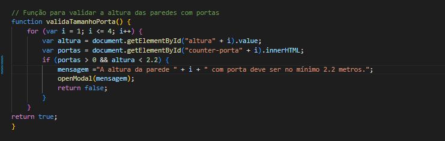

# ProjetoTintaNecessaria
Um programa que recebe o tamanho e largura de uma parede e calcula quanto de tinta será necessario para pinta-la, onde você poderá colocar portas e janelas nas mesmas e será descontado essa aréa.

#Respeitando as regras abaixo:

1.Nenhuma parede pode ter menos de 1 metro quadrado nem mais de 50 metros quadrados, mas podem possuir alturas e larguras diferentes

2.O total de área das portas e janelas deve ser no máximo 50% da área de parede

3.A altura de paredes com porta deve ser, no mínimo, 30 centímetros maior que a altura da porta

4.Cada janela possui as medidas: 2,00 x 1,20 mtos

5.Cada porta possui as medidas: 0,80 x 1,90

6.Cada litro de tinta é capaz de pintar 5m²

7.Não considerar teto nem piso.

8.As variações de tamanho das latas de tinta são: (0,5 L),(2,5 L),(3,6 L) e (18 L)

 
Faça o download do projeto: Baixe o projeto "ProjetoTintaNecessaria" em seu computador.
você deve clicar no botão em amarelo. Será baixado o arquivo no formato .zip

Após descompactar o arquivo, acesse a pasta do projeto, navegue até a pasta "tintaNecessaria" e abra um terminal na pasta.

Instalar as dependências: para instalar as dependências do projeto com o cmd aberto na pasta, utilize o comando **composer install**.

Em seguida altere o nome do arquivo de .env.example para .env

Para garantir que o programa funcione normalmente, rode o comando **php artisan key:generate** 

Use o comando **php artisan serve** 

Após isso, acesse o endereço http://localhost:8000/ no seu navegador. E o programa deve rodar normalmente.

1.Nenhuma parede pode ter menos de 1 metro quadrado nem mais de 50 metros quadrados, mas podem possuir alturas e larguras diferentes

7.Não considerar teto nem piso.

Código e layout da regra

2.O total de área das portas e janelas deve ser no máximo 50% da área de parede

4.Cada janela possui as medidas: 2,00 x 1,20 mtos

5.Cada porta possui as medidas: 0,80 x 1,90

Código e layout da regra

3.A altura de paredes com porta deve ser, no mínimo, 30 centímetros maior que a altura da porta

Código e layout da regra

6.Cada litro de tinta é capaz de pintar 5m²

8.As variações de tamanho das latas de tinta são: (0,5 L),(2,5 L),(3,6 L) e (18 L)

Código e layout da regra

O programa não aceita dados de altura e largura vazios. 

